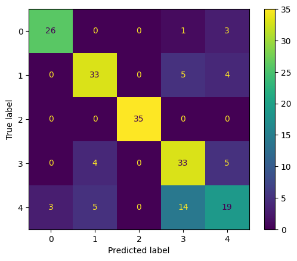
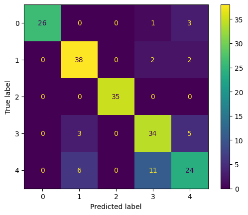
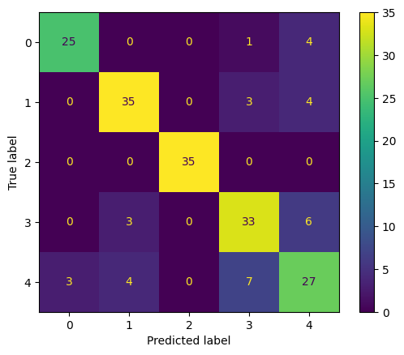

# Clustering y Clasificación de Sellers en E-Commerce – Proyecto de Análisis de Datos

> **Proyecto de análisis avanzado de datos para entender, segmentar y predecir el comportamiento de vendedores en plataformas de comercio electrónico.**

---

##  Descripción general
En un entorno digital tan competitivo como el e-commerce, entender el comportamiento de los **sellers** es clave para impulsar estrategias de crecimiento.  
Este proyecto utiliza **Machine Learning** y **embeddings generados con modelos de OpenAI** para realizar un **clustering inteligente de Sellers**, y posteriormente una **clasificación** de nuevos sellers dentro de estos clústeres.  

El enfoque combina análisis estadístico, procesamiento semántico de datos y técnicas de ML para ofrecer **una visión profunda del ecosistema de venta online**.

---

##  Tecnologías utilizadas

| Tecnología | Descripción |
|-------------|-------------|
|  **Python** | Lenguaje principal para la implementación. |
|  **Pandas** | Limpieza, transformación y análisis de datos. |
|  **scikit-learn** | Modelado de clustering y clasificación. |
|  **OpenAI – text-embedding-3-small** | Generación de embeddings vectoriales. |
|  **GenaAI** | Integración de automatizaciones e inteligencia generativa. |


---

##  Objetivo del proyecto
Desarrollar un sistema que permita **agrupar (clustering)** a los vendedores con base en sus características y comportamientos, y luego **clasificar** nuevos sellers dentro de los grupos definidos.  

En la actualidad, se ha detectado una oportunidad en la clasificacion de los sellers, pues se estan generando acciones a clientes que no tienen la capacidad y algunas ocasiones estas no llegan a clientes importantes.

Por tal razón es necesario realizar una nuevamente un clasificación de nuestros sellers, donde nuestras acciones se han optimas a los sellers que queremos llegar.

---

##  Resultados e impacto
El modelo permitió **identificar patrones significativos** entre diferentes tipos de vendedores, destacando:
- **Grupos con alto potencial de expansión**  
- **Confianza**, Si nuestros sellers sienten que las acciones que tomamos son exitosas en sus mercados, fidelizamos al seller!, incentivando a que concentre productos que tienen en otros marketplaces en el nuestro.
- **Atracción**, siempre las cosas buenas se comunican, Si nuestros están felices con nuestras estrategias, atraerán a sellers potenciales de otros marketplaces.
- **Incrementar las ventas de nuestros sellers**, esto genera un ingreso significativo tanto para los sellers como para nosotros. Si nuestras acciones son dirigidas a los clientes objetivos, se garantizara el éxito de la estrategia y esta no se perderá en otros sellers.    
- **Clasificación automática** de nuevos sellers con alta precisión.  

El impacto potencial incluye **mejor segmentación**, **mayor eficiencia comercial** y **acciones de marketing basadas en datos reales**.

---

##  Arquitectura general

```
Extracción de datos → Limpieza y preprocesamiento → Clustering → Embeddings → Clasificación
```
**Entendimiento de la Data**, Se realizo un una analisis exploratorio, en los cuales se conocio, que la data obtenida tenia datos nulos, datos outlier, variables categoricas y variables numericas, se validaron las variables, se realizo analisis de distribusion y correlacion, que permitieron conocer las relaciones que pueden darse entre las variables.

**Preparación de la Data**, se realizaron 3 tratamientos diferentes de datos, lo cual llevo a realizar 3 experiencias para poder seleccionar el mejor resultado. Entre las 3 experiencias realizamos las siguientes operaciones: limpieza de datos, eliminación de outliers, eliminación de datos nulos, creación de nuevas variables, reduccion de dimensionalidad y one-hot-encoder.

**Modelado**, se entrenaron 3 algoritmos en cada implementacion, Clusterizacion y Clasificacion. Para evaluar los algoritmos de  clusterizacion se utilizo analisis de Silueta y para los de clasificacion se evaluaron F1-Score, Recall, Precision, Accuracy y la matrix de confusion.

**Embeddings**, En la Calsificacion se generaron embeddings para mejorar el rendimiento de los algoritmos, como se menciona anteriormente se utilizao el embedding de Openai "text-embedding-3-smaall".

se entrenaron 3 algoritmos en cada implementacion, Clusterizacion y Clasificacion. Para evaluar los algoritmos de  clusterizacion se utilizo analisis de Silueta y para los de clasificacion se evaluaron F1-Score, Recall, Precision, Accuracy y la matrix de confusion.

Resumen de Evaluacion de los Modelos:

**Los Algoritmos para las Clusterizacion fueron:**

Se Generaron 5 Clusters.
- **Kmenas**: que en nuestra version 3, tuvo Score(silouette_avg)PC3: 0.767326793310841
- **DBScan**: que en nuestra version 3, tuvo Score(silouette_avg)PC3: 0.9136421236774568
- **Aglomerativo**: que en nuestra version 3, tuvo Score(silouette_avg)PC3: 0.7780466990121443

**Los Algoritmos para las Clasificacion fueron:**

- **Random Forest Classifier**: que en nuestra version 3, tuvo Score(Accuracy): 0.77.
  
  
- **Supprt Vector Machine Classifier**: que en nuestra version 3, tuvo Score(Accuracy): 0.83.
  
   
- **XGBoost Classifier**: que en nuestra version 3, tuvo Score(silouette_avg)PC3: 0.82.
-  

---

 


---

##  Conclusiones
Este proyecto demuestra cómo la **inteligencia artificial y el análisis de datos** pueden transformar la gestión del e-commerce, ayudando a descubrir patrones ocultos y a tomar decisiones estratégicas basadas en evidencia.  

 - Una parte fundamental en este ejercicio fue elegir un conjunto de datos, que mantuvieran la información necesaria tanto para poder realizar la cauterización como para la clasificación. Saber identificar que datos, imputar o eliminar marcan   la diferencia. ya que en la versión v3, se elimino completamente la columna “regular_prices”, ya que tenia un 73% de datos null.
- Es muy bueno analizar los datos outlier, en este caso en particular los outlier representaban clientes muy específicos. en el v2 los elimine y en el v3 los mantuve, cabe resaltar que estas variables se pueden revisar con el negocio ya que     poseen mayor conocimiento de ello.
- Tener muchas variables no mejora la implementacion de un modelo de machine learning, puede hacer que el modelo se vuelva robusto.
- El uso de embedding en el manejo de varbiables categoricas es indiscutibles, esto permite muchos mas que una codificacion.
- Evaluar diferentes modelos es primordial, ya que no todos los modelos se comportan igual con las caracteristicas de los datos.

Representación conceptual de los clústeres y clasificación de sellers según su comportamiento.
### Segmentacion segun patrones identificados:

| Kmeans |  stock  |     price    | Products | Sellers |
| :----: | :-----: | :----------: | :------: | :-----: |
|   0.0  |  66.38  |    2256.25   |   3.10   |  73,984 |
|   1.0  | 4698.62 |    463.72    |   5.30   |  1,157  |
|   2.0  |   1.00  | 9,645,999.80 |   1.00   |    5    |
|   3.0  |  44.15  |    1686.09   |   37.65  |  18,082 |
|   4.0  |  97.97  |    2083.99   |   13.00  |  38,367 |

Cluster 0:  Sellers Estables: alta densidad de sellers, con precios medios y promedio en stock razonable. con un catalogo ya maduro pues, se carateriza por tener buen inventario de ellos.
Cluster 1:  Sellers Mayoristas: Mantiene un stock alto, pocos productos y precios bajos.
Cluster 2: Sellers Premiuns Ocasionales: un stock demasiado bajo, pocos productos y precios altos.
Cluster 3: Sellers Volumen: Ya que manejan altos inventarios sobre los mayoristas, con un precio demasiado bajo y poco productos, su negocio se centra exclusivamente en vender cantidades.
Cluster 4: Sellers Dinamicos: un stock promedio con precios altos, pocos productos, catalogo especializado.


El siguiente paso será integrar estos modelos dentro de un flujo automatizado que actualice y clasifique vendedores en tiempo real.  

---


**Adrián Martínez**  
Contacto: ing.va.martinez@gmail.com*  
Proyecto desarrollado con propósito académico y analítico.
